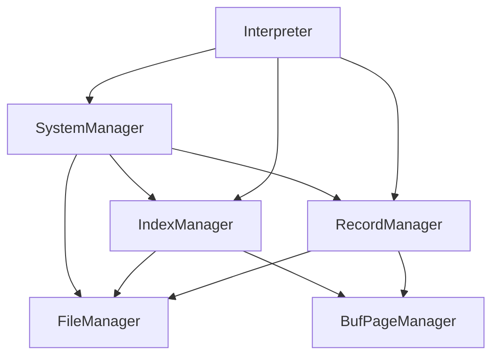

# 数据库大作业报告 Group 9

> 洪一宁 2020011022
>
> 吴斯媛 2020011706


## 系统架构设计

### 1 各模块逻辑关系



### 2 文件路径约定

```bash
dbs-project-19
├── ... # 仓库里本来就有的其他东西
├── data # 存数据库数据的地方
│   ├── global # 存数据库global信息的地方
│   |   └── AllDatabase.txt # record类文件，存储所有数据库名字-数据库id的对应关系,参考SystemColumns.hpp。因为recordManager会给所有item分配一个唯一不变的id，所以这个表格创建时只需要一个column，即数据库名字
│   └── base # 存储各个数据库信息的地方
|       ├── db1 # 文件夹名字是'db'+一个数字，对应数据库id；也就是，每个文件夹对应一个数据库
|       |   ├── AllTable.txt # record类文件，存储1号数据库中所有table的信息，即所有table名字-table id的对应关系，仿照AllDatabase.txt即可
|       |   ├── tb1 # 存储1号数据库的1号表格的信息的地方，也即一个文件夹对应一个table；为方便叙述，假设table1有l列
|       |   |   ├── Record.txt # record类文件 存储表格的所有数据，但不包括主键外键索引信息
|       |   |   ├── PrimaryKey.txt # record类文件，存储所有主键信息 （初始化record.txt之后，会给每个column分配唯一的column_id，PrimaryKey.txt里只有一列即primary_key_id，存储是主键的列的信息）（举个栗子，有一个table有10个column，其中的column_id为1、3、5的三列组成联合主键，那么primarykey.txt里就存了三条记录：1，3和5）
|       |   |   ├── ForeignKey.txt # record类表格，存储所有外键信息。如果record.txt中有l列（即table1有l列），那么ForeignKey.txt中就有2l+1列，每条数据代表一个外键对应关系。每条数据的第一列代表该（联合）外键对应关系对应的是哪个table的（联合主键）（用table_id）指定。然后l列表示本表中的哪些列是该（联合）外键的组成部分（类似于VECTOR,用column_id指定，多的给NULL），然后l列表示本表中组成（联合）外键对应的是（联合）主键中的哪一列（用column_id指定）。
|       |   |   ├── Dominates.txt # record类表格，记录有哪些表格的（联合）外键指向了本表；用来方便以下操作：修改本表的时候需要检查其他有（联合）外键指向本表的表格是否合法；删除本表时其他表格不可以有（联合）外键指向本表；一列就够了，记一个表格id
|       |   |   ├── IndexInfo.txt # record类表格，记录目前本表有哪些index，对应的index_id是什么；有l列，每列表示一个已经建立的index_file。l列分别表示对应的index_file是哪些列的联合索引
|       |   |   └── IndexFiles # 文件夹，存所有index
|       |   |       ├── Index1.txt # index类文件，对应index_id为1的索引
|       |   |       ├── Index2.txt # index类文件，对应index_id为2的索引
|       |   |       ├── ...
|       |   |       └── Indexi.txt # index类文件，对应index_id为i的索引
|       |   ├── tb2 # 存储1号数据库的2号表格的信息的地方 （内容不写了，仿照1号表格）
|       |   |   └── ...
|       |   ├── tb3 # 存储1号数据库的3号表格的信息的地方 （内容不写了，仿照1号表格）
|       |   |   └── ...
|       |   ├── ...
|       |   └── tbm # 存储1号数据库的m号表格的信息的地方 （内容不写了，仿照1号表格）
|       |       └── ...
|       ├── db2 # 2号数据库 （内容不写了，仿照1号数据库）
|       |   └── ...
|       ├── db3 # 3号数据库 （内容不写了，仿照1号数据库）
|       |   └── ...
|       ├── ...
|       └── dbn # n号数据库（内容不写了，仿照1号数据库）
|           └── ...
└── ... # 仓库里本来就有的其他东西
```


### 3 记录格式

#### 3.1 Basics

- 每页8192B = 2048BufType

- 1B = 8b

- 1 BufType = 32B

- INT占4B，FLOAT4B，CHAR1B，DATE4B = 2B YEAR + 1B MONTH + 1B DAY

#### 3.2 记录页

##### 首页

- 16B：bitmap，16*8 = 128

- 4B：有多少column

- 4B：除首页外还有多少页

- 4B 记录ID上限

- 4B: NULL BITMAP size （多少个buf)

之后每80B一条column记录

- 4B：columnID

- 1B：数据类型（INT0，FLOAT1，VARCHAR2，DATE3）

- 1B：column name的长度

- 2B：VARCHAR的最大值（不是varchar的话这里的值无意义）

- 4B：VARCHAR SPACE

- 32B：column name

- 2B：是否要求不为NULL；是否有default value；default value是否是NULL；是否要求UNIQUE

- 2B：DEFAULT VALUE的长度，仅对varchar有意义

- 32B：DEFAULT VALUE的值

##### 记录页

- 16Buf = 64B = 512bit 的bitmap

- id：4B，永远且唯一的标识

- 一个向4B对齐的bitmap表示是否为null

- int: 4B

- float: 8B

- date: 4B

- varchar: 长度 2B，varchar space (一开始开两倍)

- 以上空间再多给一倍

#### 3.3 索引

##### 首页

- buf[0]：index含有多少key （k）

- buf[1]：首页是哪页

- 第二页：使用页号的bitmap, b[-1]表示bitmap下一页的id

- m = (8192B - 60B) / (4B * (k + 6)) = 2033 / (K + 6)

##### 叶节点

- 4B：上一个同级节点的页号

- 4B：下一个同级节点的页号

- 4B：多少个孩子

- 4B：是不是叶节点

每条记录：

- 4B * (k + 2) /条 （至少12B），包含：

- 4B：record.page_id

- 4B：record.slot_id

- 4B * k： key

##### 非叶节点

- 4B：上一个同级节点的页号

- 4B：下一个同级节点的页号

- 4B：多少个孩子

- 4B：是不是叶节点

每个子节点：4B * (k + 1)，至少8B

- 4B：子节点页号

- 4B*k：子节点中的最大关键字


## 各模块详细设计

### 命令解析器

### 查询解析模块

### 系统管理模块

### 索引模块

### 记录管理模块

### 页式文件系统


## 主要接口说明


## 实验结果

### 基本功能

### 拓展功能


## 小组分工


## 参考文献


