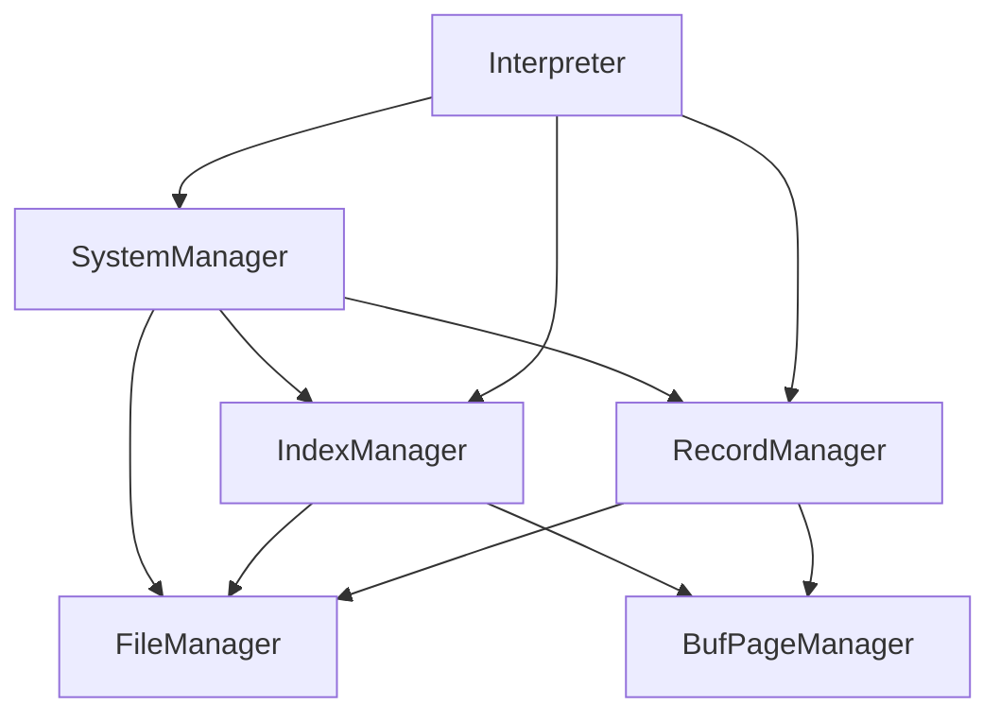

# 借口约定

## 1 各模块逻辑关系



IndexManager/RecordManger只能处理某一个**指定文件**的record管理/index管理操作。

注意record manager处理不了主键外键。

SystemManager处理系统方面（**尤其是文件路径管理**）方面的操作。

## 2 文件路径约定（SystemManager相关）

（system manager的接口写的比较早，应该现在有些问题，主要是目前处理不了主键外键，需要改改w，另外SystemManager不需要连bpm）

文件目录约定（目前想的，从目录到文件名都可以随便改）：

```bash
dbs-project-19
├── ... # 仓库里本来就有的其他东西
├── data # 存数据库数据的地方
│   ├── global # 存数据库global信息的地方
│   |   └── AllDatabase.txt # record类文件，存储所有数据库名字-数据库id的对应关系,参考SystemColumns.hpp。因为recordManager会给所有item分配一个唯一不变的id，所以这个表格创建时只需要一个column，即数据库名字
│   └── base # 存储各个数据库信息的地方
|       ├── db1 # 文件夹名字是'db'+一个数字，对应数据库id；也就是，每个文件夹对应一个数据库
|       |   ├── AllTable.txt # record类文件，存储1号数据库中所有table的信息，即所有table名字-table id的对应关系，仿照AllDatabase.txt即可
|       |   ├── tb1 # 存储1号数据库的1号表格的信息的地方，也即一个文件夹对应一个table；为方便叙述，假设table1有l列
|       |   |   ├── Record.txt # record类文件 存储表格的所有数据，但不包括主键外键索引信息
|       |   |   ├── PrimaryKey.txt # record类文件，存储所有主键信息 （初始化record.txt之后，会给每个column分配唯一的column_id，PrimaryKey.txt里只有一列即primary_key_id，存储是主键的列的信息）（举个栗子，有一个table有10个column，其中的column_id为1、3、5的三列组成联合主键，那么primarykey.txt里就存了三条记录：1，3和5）
|       |   |   ├── ForeignKey.txt # record类表格，存储所有外键信息。如果record.txt中有l列（即table1有l列），那么ForeignKey.txt中就有2l+1列，每条数据代表一个外键对应关系。每条数据的第一列代表该（联合）外键对应关系对应的是哪个table的（联合主键）（用table_id）指定。然后l列表示本表中的哪些列是该（联合）外键的组成部分（类似于VECTOR,用column_id指定，多的给NULL），然后l列表示本表中组成（联合）外键对应的是（联合）主键中的哪一列（用column_id指定）。
|       |   |   ├── Dominates.txt # record类表格，记录有哪些表格的（联合）外键指向了本表；用来方便以下操作：修改本表的时候需要检查其他有（联合）外键指向本表的表格是否合法；删除本表时其他表格不可以有（联合）外键指向本表；一列就够了，记一个表格id
|       |   |   ├── IndexInfo.txt # record类表格，记录目前本表有哪些index，对应的index_id是什么；有l列，每列表示一个已经建立的index_file。l列分别表示对应的index_file是哪些列的联合索引
|       |   |   └── IndexFiles # 文件夹，存所有index
|       |   |       ├── Index1.txt # index类文件，对应index_id为1的索引
|       |   |       ├── Index2.txt # index类文件，对应index_id为2的索引
|       |   |       ├── ...
|       |   |       └── Indexi.txt # index类文件，对应index_id为i的索引
|       |   ├── tb2 # 存储1号数据库的2号表格的信息的地方 （内容不写了，仿照1号表格）
|       |   |   └── ...
|       |   ├── tb3 # 存储1号数据库的3号表格的信息的地方 （内容不写了，仿照1号表格）
|       |   |   └── ...
|       |   ├── ...
|       |   └── tbm # 存储1号数据库的m号表格的信息的地方 （内容不写了，仿照1号表格）
|       |       └── ...
|       ├── db2 # 2号数据库 （内容不写了，仿照1号数据库）
|       |   └── ...
|       ├── db3 # 3号数据库 （内容不写了，仿照1号数据库）
|       |   └── ...
|       ├── ...
|       └── dbn # n号数据库（内容不写了，仿照1号数据库）
|           └── ...
└── ... # 仓库里本来就有的其他东西
```

db/table/index的编号不一定连续，但一定唯一（考虑到可能会删除数据库/表格的情况）

## 3 SystemManager要做什么

systemManager需要进行各类文件管理操作：

举个栗子，创建一个名为db1的新数据库：

systemManager需要先访问./data/global/AllDatabase.txt，检查有没有重名的。如果有，返回false；

然后，在./data/global/AllDatabase.txt插入一条新记录，即db1，并查询以获得db1对应的database_id是多少。我们假设database_id是10。

然后，创建文件夹./data/base/db10。

然后，初始化文件./data/base/db10/AllTable.txt。

结束。


举个栗子，use system db1:

systemManager需要先访问./data/global/AllDatabase.txt，找到db1对应的id，并用类成员记录下这个id，方便之后随时调用/返回（这个接口SystemManager里我还没写但之后肯定得有）


举个栗子，删除table1：

假设我们之前有过一条指令，use system db1

我们通过SystemManager的成员变量current_db_id （随便起的名，之后随便改xs），得知我们要删除的是编号为current_db_id中名为table1的表格。

假设current_db_id = 2;

那么systemManager需要负责访问data/base/db2/AllTable.txt，找到table1是否存在，对应的table_id是多少。如果不存在返回false。如果存在，这里我们假设table_id是3。

然后访问data/base/db2/tb3/Dominates.txt，检查是不是空的，如果非空那么不能删（外键的依赖关系满足不了），返回false。

然后访问data/base/db2/tb3/ForeignKey.txt，把外键连接的主键对应的文件的dominates.txt里相应的item删掉。

然后删掉文件夹data/base/db2/tb3

然后删掉文件data/base/db2/AllTable.txt中table1对应的那条记录。

## 4 为什么不全用名字而是总要建立name-id的对应关系

方便改名操作。这样改名只改一个文件就行了，其他全都不用动。

比如把数据库a的表格b的列c的名字从name1改成name2，我们只需要改一下record文件的列id-列名映射就可以，不需要有修改主键外键/其他表格外键连接到本表主键之类的麻烦操作。

## 5 其他

接口都是暂定的，都可以改，包括有的时候是用path好还是用id好主要还是看interpreter怎么着更方便xd 或者也可以两个接口都写，多写两行调用的事x

而且我现在接口里大概率有typo（

如果record/index缺接口随时来戳我 我速速写x


另外systemmanager和interpreter也没有分的很开；如果一个功能interpreter要使用很多次那就扔到systemmanager就好了，反正随时写新接口x

